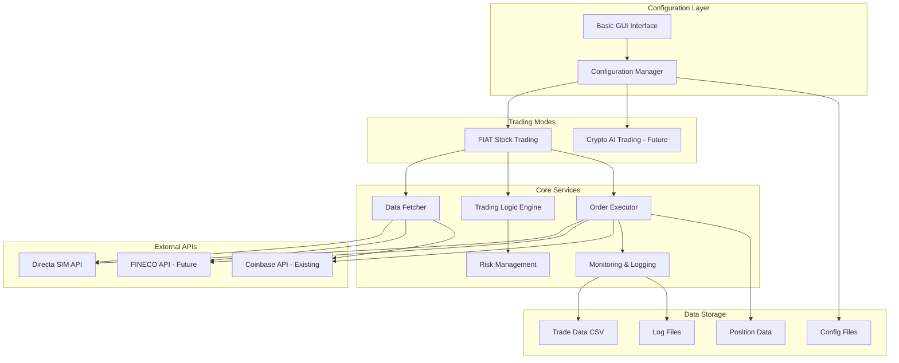

# Design Document

## Overview

The Chronos AI Trading Agent design builds upon the existing cryptocurrency trading infrastructure to create a dual-mode system supporting both FIAT stock trading and cryptocurrency trading. The initial MVP focuses exclusively on FIAT stock trading using the Directa SIM API, with the existing crypto infrastructure temporarily disabled but preserved for future integration.

The system follows a modular architecture where trading modes can be independently enabled/disabled, with shared components for configuration, monitoring, and data management. The design prioritizes rapid deployment of basic algorithmic trading functionality while maintaining extensibility for future enhancements.

## Architecture

### High-Level Architecture



### System Components

The system extends the existing modular architecture with new components for FIAT stock trading:

1. **Broker Abstraction Layer**: New abstraction to support multiple broker APIs
2. **FIAT Trading Logic**: Basic algorithmic trading strategies for stocks
3. **Enhanced Configuration**: Support for dual-mode operation and broker-specific settings
4. **Cost Calculator**: Italian tax and fee calculation for FIAT trades
5. **Basic GUI**: Simple monitoring and configuration interface

## Components and Interfaces

### Broker Abstraction Layer

```python
class BrokerInterface:
    """Abstract base class for all broker implementations"""
    
    def connect(self) -> bool:
        """Establish connection to broker API"""
        pass
    
    def get_realtime_data(self, symbol: str) -> Dict:
        """Fetch current price and volume data"""
        pass
    
    def place_order(self, order: Order) -> str:
        """Execute buy/sell order, return order ID"""
        pass
    
    def get_positions(self) -> List[Position]:
        """Get current positions"""
        pass
    
    def get_account_info(self) -> Dict:
        """Get account balance and info"""
        pass

class DirectaBroker(BrokerInterface):
    """Directa SIM API implementation"""
    
    def __init__(self, config: Dict):
        self.api_key = config['directa']['api_key']
        self.base_url = config['directa']['base_url']
        self.session = None
    
    def connect(self) -> bool:
        """Authenticate with Directa SIM API"""
        # Implementation for Directa authentication
        pass

class FINECOBroker(BrokerInterface):
    """FINECO API implementation - Future"""
    pass
```

### Enhanced Data Fetcher

The existing `DataFetcher` class will be extended to support multiple broker APIs:

```python
class UnifiedDataFetcher:
    """Extended data fetcher supporting multiple brokers"""
    
    def __init__(self, config):
        self.config = config
        self.brokers = {}
        self._initialize_brokers()
    
    def _initialize_brokers(self):
        """Initialize broker connections based on config"""
        if self.config.get('fiat_trading', {}).get('enabled'):
            if 'directa' in self.config:
                self.brokers['directa'] = DirectaBroker(self.config)
        
        if self.config.get('crypto_trading', {}).get('enabled'):
            if 'coinbase' in self.config:
                self.brokers['coinbase'] = CoinbaseBroker(self.config)
    
    def fetch_realtime_data(self, symbol: str, broker: str) -> pd.DataFrame:
        """Fetch real-time data from specified broker"""
        if broker not in self.brokers:
            raise ValueError(f"Broker {broker} not configured")
        
        return self.brokers[broker].get_realtime_data(symbol)
```

### FIAT Trading Logic

New trading logic component for basic algorithmic strategies:

```python
class FIATTradingLogic:
    """Basic algorithmic trading logic for FIAT stocks"""
    
    def __init__(self, config):
        self.config = config
        self.daily_stats = {}  # Track min/max for each symbol
        self.cost_calculator = CostCalculator(config)
    
    def update_daily_stats(self, symbol: str, price: float):
        """Update daily min/max tracking"""
        if symbol not in self.daily_stats:
            self.daily_stats[symbol] = {
                'min': price, 'max': price, 'date': datetime.now().date()
            }
        
        stats = self.daily_stats[symbol]
        if datetime.now().date() != stats['date']:
            # New day, reset stats
            stats = {'min': price, 'max': price, 'date': datetime.now().date()}
            self.daily_stats[symbol] = stats
        else:
            stats['min'] = min(stats['min'], price)
            stats['max'] = max(stats['max'], price)
    
    def generate_signal(self, symbol: str, current_price: float, position: Position = None) -> str:
        """Generate BUY/SELL/HOLD signal based on basic algorithm"""
        self.update_daily_stats(symbol, current_price)
        
        symbol_config = self.config['fiat_trading']['symbols'].get(symbol, {})
        buy_threshold = symbol_config.get('buy_threshold', 0.02)  # 2% below daily high
        sell_threshold = symbol_config.get('sell_threshold', 0.03)  # 3% above purchase price
        
        stats = self.daily_stats[symbol]
        
        # Basic buy logic: price dropped from daily high
        if current_price <= stats['max'] * (1 - buy_threshold):
            if not position or position.quantity == 0:
                return "BUY"
        
        # Basic sell logic: price above purchase price + threshold
        if position and position.quantity > 0:
            target_price = position.avg_cost * (1 + sell_threshold)
            if current_price >= target_price:
                return "SELL"
        
        return "HOLD"
```

### Cost Calculator

New component for calculating Italian taxes and fees:

```python
class CostCalculator:
    """Calculate trading costs including Italian capital gains tax"""
    
    def __init__(self, config):
        self.config = config
        self.capital_gains_tax_rate = 0.26  # 26% Italian capital gains tax
        self.broker_fees = config.get('cost_calculation', {})
    
    def calculate_trade_cost(self, broker: str, trade_value: float) -> Dict:
        """Calculate total cost for a trade"""
        broker_config = self.broker_fees.get(broker, {})
        
        # Fixed fee per trade
        fixed_fee = broker_config.get('fixed_fee', 0.0)
        
        # Percentage fee
        percentage_fee = trade_value * broker_config.get('percentage_fee', 0.0)
        
        # Spread cost (estimated)
        spread_cost = trade_value * broker_config.get('spread_estimate', 0.001)
        
        total_fees = fixed_fee + percentage_fee + spread_cost
        
        return {
            'fixed_fee': fixed_fee,
            'percentage_fee': percentage_fee,
            'spread_cost': spread_cost,
            'total_fees': total_fees
        }
    
    def calculate_net_profit(self, buy_price: float, sell_price: float, 
                           quantity: float, broker: str) -> Dict:
        """Calculate net profit after all costs and taxes"""
        gross_profit = (sell_price - buy_price) * quantity
        
        buy_costs = self.calculate_trade_cost(broker, buy_price * quantity)
        sell_costs = self.calculate_trade_cost(broker, sell_price * quantity)
        total_fees = buy_costs['total_fees'] + sell_costs['total_fees']
        
        # Capital gains tax only on positive gains
        capital_gains_tax = 0.0
        if gross_profit > 0:
            capital_gains_tax = gross_profit * self.capital_gains_tax_rate
        
        net_profit = gross_profit - total_fees - capital_gains_tax
        
        return {
            'gross_profit': gross_profit,
            'total_fees': total_fees,
            'capital_gains_tax': capital_gains_tax,
            'net_profit': net_profit,
            'roi': net_profit / (buy_price * quantity) if buy_price > 0 else 0
        }
```

### Enhanced Order Executor

Extension of existing order executor to support multiple brokers:

```python
class UnifiedOrderExecutor:
    """Enhanced order executor supporting multiple brokers"""
    
    def __init__(self, config):
        self.config = config
        self.brokers = {}
        self.cost_calculator = CostCalculator(config)
        self._initialize_brokers()
    
    def execute_order(self, symbol: str, side: str, quantity: float, 
                     broker: str, order_type: str = "market") -> str:
        """Execute order through specified broker"""
        if broker not in self.brokers:
            raise ValueError(f"Broker {broker} not available")
        
        # Pre-trade cost analysis
        current_price = self.brokers[broker].get_realtime_data(symbol)['price']
        trade_value = current_price * quantity
        costs = self.cost_calculator.calculate_trade_cost(broker, trade_value)
        
        logger.info(f"Executing {side} order: {quantity} {symbol} @ {current_price}")
        logger.info(f"Estimated costs: {costs}")
        
        order = Order(
            symbol=symbol,
            side=side,
            quantity=quantity,
            order_type=order_type,
            broker=broker
        )
        
        return self.brokers[broker].place_order(order)
```

## Data Models

### Enhanced Configuration Model

```yaml
# Extended configuration supporting dual-mode operation
trading_modes:
  fiat_enabled: true
  crypto_enabled: false  # Disabled for MVP

fiat_trading:
  enabled: true
  default_broker: "directa"
  symbols:
    "AAPL":
      buy_threshold: 0.02
      sell_threshold: 0.03
      max_position_size: 1000
    "MSFT":
      buy_threshold: 0.015
      sell_threshold: 0.025
      max_position_size: 500

directa:
  api_key: "${DIRECTA_API_KEY}"
  base_url: "https://api.directa.it"
  account_id: "${DIRECTA_ACCOUNT_ID}"

fineco:  # Future
  api_key: "${FINECO_API_KEY}"
  base_url: "https://api.fineco.it"

cost_calculation:
  directa:
    fixed_fee: 2.95
    percentage_fee: 0.0019
    spread_estimate: 0.001
  fineco:
    fixed_fee: 3.95
    percentage_fee: 0.0015
    spread_estimate: 0.001

risk_management:
  max_daily_loss: 500.0
  max_position_percentage: 0.1
  stop_loss_percentage: 0.05

gui:
  enabled: true
  port: 8080
  refresh_interval: 5
```

### Position Model

```python
@dataclass
class Position:
    symbol: str
    broker: str
    quantity: float
    avg_cost: float
    current_price: float
    unrealized_pnl: float
    last_updated: datetime
    
    def update_price(self, new_price: float):
        self.current_price = new_price
        self.unrealized_pnl = (new_price - self.avg_cost) * self.quantity
        self.last_updated = datetime.now()
```

### Order Model

```python
@dataclass
class Order:
    symbol: str
    side: str  # "BUY" or "SELL"
    quantity: float
    order_type: str  # "market", "limit", "stop"
    broker: str
    price: Optional[float] = None
    stop_price: Optional[float] = None
    status: str = "pending"
    order_id: Optional[str] = None
    created_at: datetime = field(default_factory=datetime.now)
```

## Error Handling

### Broker Connection Management

```python
class BrokerConnectionManager:
    """Manages broker connections with retry logic"""
    
    def __init__(self, config):
        self.config = config
        self.retry_config = config.get('retry', {})
        self.max_retries = self.retry_config.get('max_retries', 3)
        self.backoff_factor = self.retry_config.get('backoff_factor', 2)
    
    def execute_with_retry(self, broker: str, operation: callable, *args, **kwargs):
        """Execute broker operation with exponential backoff retry"""
        for attempt in range(self.max_retries):
            try:
                return operation(*args, **kwargs)
            except BrokerConnectionError as e:
                if attempt == self.max_retries - 1:
                    logger.error(f"Max retries exceeded for {broker}: {e}")
                    raise
                
                wait_time = self.backoff_factor ** attempt
                logger.warning(f"Broker {broker} error, retrying in {wait_time}s: {e}")
                time.sleep(wait_time)
```

### Graceful Degradation

The system implements graceful degradation when broker APIs are unavailable:

1. **Monitoring Mode**: Continue data collection without trading
2. **Backup Broker**: Failover to secondary broker if configured
3. **Alert System**: Notify administrators of critical failures
4. **State Persistence**: Save current positions and orders to disk

## Testing Strategy

### Unit Testing

Each component will have comprehensive unit tests:

```python
class TestFIATTradingLogic(unittest.TestCase):
    def setUp(self):
        self.config = {
            'fiat_trading': {
                'symbols': {
                    'TEST': {
                        'buy_threshold': 0.02,
                        'sell_threshold': 0.03
                    }
                }
            }
        }
        self.logic = FIATTradingLogic(self.config)
    
    def test_buy_signal_generation(self):
        # Test buy signal when price drops from daily high
        self.logic.update_daily_stats('TEST', 100.0)  # Set daily high
        signal = self.logic.generate_signal('TEST', 98.0)  # 2% drop
        self.assertEqual(signal, 'BUY')
    
    def test_sell_signal_generation(self):
        # Test sell signal when price exceeds target
        position = Position('TEST', 'directa', 100, 95.0, 98.0, 300.0, datetime.now())
        signal = self.logic.generate_signal('TEST', 98.0, position)
        self.assertEqual(signal, 'SELL')
```

### Integration Testing

```python
class TestBrokerIntegration(unittest.TestCase):
    def setUp(self):
        self.config = load_test_config()
        self.broker = DirectaBroker(self.config)
    
    @patch('requests.post')
    def test_order_execution(self, mock_post):
        # Mock successful order response
        mock_post.return_value.json.return_value = {'order_id': '12345', 'status': 'filled'}
        
        order = Order('TEST', 'BUY', 100, 'market', 'directa')
        order_id = self.broker.place_order(order)
        
        self.assertEqual(order_id, '12345')
```

### End-to-End Testing

```python
class TestTradingWorkflow(unittest.TestCase):
    def test_complete_trading_cycle(self):
        """Test complete buy-sell cycle with cost calculations"""
        # Setup test environment with mock broker
        # Execute buy order
        # Simulate price movement
        # Execute sell order
        # Verify cost calculations and P&L
        pass
```

The testing strategy ensures reliability and correctness of the trading system before deployment to live markets.